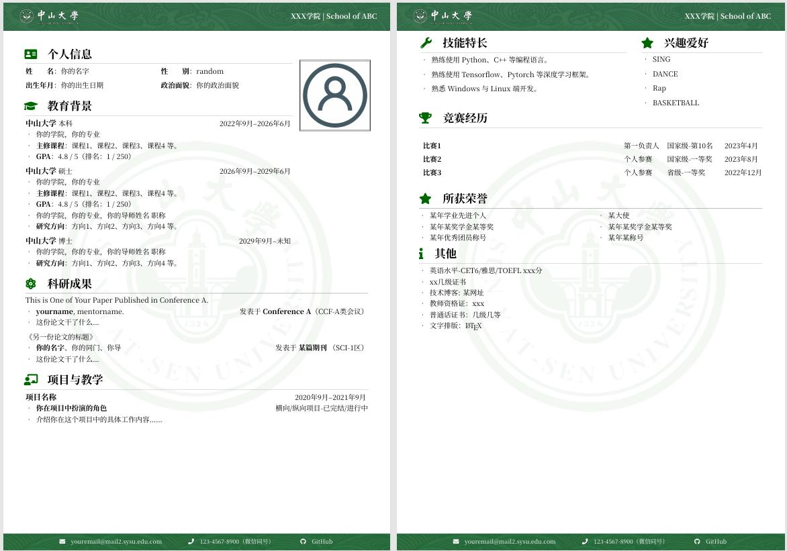

# SYSU-CV：中山大学 LaTeX 中文简历模板



## 下载链接
[
](https://github.com/sorosyhr/SYSU-CV/archive/refs/heads/main.zip)
## 简介
又到了毕业季，无论是找工作、找实习，还是申请深造，一份专业的简历都必不可少。作为中山大学的学生，我在网上找了很久，却没有找到合适的中大专属简历模板。于是，我决定参考其他学校的优秀模板，自己动手做了一个——这就是 ​SYSU-CV 的由来。

为了让更多校友顺利走向未来，我特此开源这份模板，希望大家都能用它制作出令人眼前一亮的简历，斩获心仪的 offer！

**SYSU-CV** 是一个专为中山大学学生设计的中文简历 LaTeX 模板。它基于以下模板进行优化和定制：

• [WHU 中文 CV 模板](https://www.overleaf.com/latex/templates/whuwu-han-da-xue-zhong-wen-jian-li-mo-ban/dbkvxrqjmzpd)
• [NPU 中文 CV 模板](https://www.overleaf.com/latex/templates/npu-cv/mncqzxhvfzrx)
• [SEU 中文 CV 模板](https://www.overleaf.com/latex/templates/seu-cv-dong-nan-da-xue-latex-zhong-wen-jian-li-mo-ban/jyzpthvnbmpm)

万分感谢以上！！！

---

## 功能特点

• **中山大学主题风格**：采用中山大学主题绿色（`SYSU_Green`），简洁大气。
• **模块化设计**：个人信息、教育背景、项目经历、技能特长等模块清晰划分，易于编辑。
• **多页支持**：支持多页简历，页眉、页脚和背景自动适配。
• **兼容性强**：支持 `XeLaTeX` 和 `LuaLaTeX` 编译。

---

## 使用方法

1. **上传项目**：将整个项目文件夹上传到 [Overleaf](https://www.overleaf.com/)。
2. **编辑内容**：打开 `main_xx.tex` 文件，修改个人信息、教育背景、项目经历等内容。
3. **编译文档**：选择 `XeLaTeX` 或 `LuaLaTeX` 编译，生成 PDF 文件。
4. **下载 PDF**：点击下载按钮，保存生成的 PDF 文件。

---

## 文件结构

```
SYSU-CV/
├── docs/                    # 文档和示例图片
│   └── CV-preview.jpg       # 简历预览图
│   └── SYSU_CV-preview.pdf  # 简历预览pdf
├── fonts/                   # 字体文件
├── images/                  # 图片资源（如校徽、头像）
├── main.tex                 # 主文件
└── README.md                # 项目说明
```

---

## 自定义指南

### 1. 修改个人信息
编辑 `main.tex` 中的以下部分：
```latex
% 个人信息
\section[个人信息]{\makebox[\widthof{\faUser}][c]{\color{SYSU_Green}{\faUser}}\quad 个人信息}
\begin{minipage}[t]{0.5\textwidth}
    \textbf{姓\qquad 名}：你的名字
    \vspace{0.5em}
    \textbf{出生年月}：你的出生日期
\end{minipage}
```

### 2. 添加或修改模块
在 `main.tex` 中添加或修改以下模块：
• 教育背景
• 项目经历
• 技能特长
• 所获荣誉
• 其他

### 3. 更换图片
将 `images/avatar.png` 文件夹中的图片替换为您的个人照片。

---

## 示例预览


---

## 贡献与反馈

如果您发现任何问题或有改进建议，欢迎提交 Issue 或 Pull Request。您的贡献将帮助更多人！

---

## 许可证

本项目基于 [MIT License](LICENSE) 开源。

---

感谢使用 **SYSU-CV**！

---

### 提示

• 请确保使用 `XeLaTeX` 或 `LuaLaTeX` 编译。
• 如果遇到字体问题，请检查 `fonts/` 文件夹中的字体文件是否正确加入和加载。

